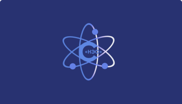

<h1 align="center"><a href="https://www.psychology.unionsee.ru/"> Psychological center</a></h1>
<h2 align="center">About the Project</h2>

This is an actual website project for <a href="https://www.psychology.unionsee.ru/">the Psychological center</a> of the Expert Union for human resources training and integration into science, education and the real sector of economy. Design and development of the website aim to be functional and intuitively understandable and convenient for visitors. The web page is also adapted for mobile devices to enhance ease of use.

<h2 align="center">Structure of the Project</h2>

The website consists of the following main parts and sections:

<ul> 
  <li>Header: the company logo and navigation menu.</li>
  <li>Main Sections includes the homepage, information about the company, its activities, specialists and reviews, partners, contacts, educational and employment opportunities. </li>
  <li>Footer сontains the company logo, main sections and the documents links (privacy policy, terms os service).</li>
</ul>
<h2 align="center">Languages and tools</h2>
<table>
    <tr>
        <th></th>
        <th></th>
        <th></th>
        <th></th>
        <th></th>
    </tr>
    <tr>
        <td>SCSS</td>
        <td>HTML</td>
        <td>JS</td>
        <td>BEM</td>
        <td>BOOTSTRAP</td>
    </tr>
</table>

<h2 align="center">Project team</h2>
<ul> 
  <li>&#9734; Team leader <a href="https://github.com/Rasalila"> Rasalila Krasnovskaya</a> (Header + Homepage)</li>
  <li>&#9734; Team leader <a href="https://github.com/makfluffy575">Maria Shatskaya</a> (Section "Staff", web page test + AWD)</li>  
  <li><a href="https://github.com/Vitalia-art">Vitalia</a> (Sections "About company" + "Activities")</li>
  <li><a href="https://github.com/Alia-s-s">Alexandra</a> (Section "Education and job", design and web page layout)</li>
  <li><a href="https://github.com/DianaSlastenova">Diana Slastenova</a> (Section "Reviews")</li>
  <li><a href="https://github.com/boyarovaolga">Olga Boyarova</a> (Section "Partners")</li>
  <li><a href="https://github.com/gosalynmallard">Olya Palkicheva</a> (Section "Contacts", project management)</li>
  <li><a href="https://github.com/saitovaan35">Anastasia Saitova</a> (Footer)</li>
</ul>
<h2 align="center">Sources</h2>
https://edu.unionsee.ru
https://rakhimkulova-expert.com/main

<h2 align="center">Аннотация на русском языке</h2>

В рамках данного проекта разработан <a href="https://www.psychology.unionsee.ru/">сайт Психологического центра</a> Союза экспертов в сфере подготовки кадров и их интеграции в науку, образование и реальный сектор экономики (далее - организация). Дизайн и подход к разработке сайта отвечают функциональным требованиям, а также интуитивно понятны и удобны для посетителей. Сайт также адаптирован для просмотра с мобильных устройств.

<h3>Структура проекта</h3>

Верхний колонтикул (header) включает логотип организации, а также меню навигации.

Основная часть (main) включает следующие секции:

<ul> 
  <li>Домашняя страница;</li>
  <li>Информация об организации и направлениях ее деятельности;</li>
  <li>Сведения о специалистах и отзывы о них;</li>
  <li>Информация о возможностях в сферах образования и трудоустройства;</li>
  <li>Информация о партнерах;</li>
  <li>Контактная информация.</li>
</ul>

Нижний колонтикул (footer) содержит логотип компании, а также ссылки на основные разделы сайта и документы (политика конфиденциальности, пользовательское соглашение).

